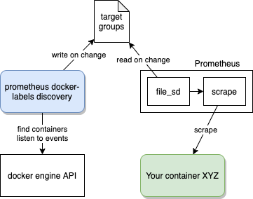

Discover docker containers to scrape based on labels
====

This tool aims at discovering containers running
with `prometheus.io/scrape=true` annotations
from a given docker engine, and auto-configure prometheus for scraping.

This tool is standalone and write the discovered containers (services) in a file,
which is in turn passed to Prometheus file service discovery to start the scraping jobs.



# Example via a docker-compose

The following part is giving a complete example of configuring the docker-labels discovery mechanism.
It is based in three parts, namely:
- Configure prometheus-docker-labels-discovery
- Configure Prometheus file_sd_configs
- Configure your services

## Configure prometheus-docker-labels-discovery

```
  prometheus-docker-labels-discovery:
    image: sqooba/prometheus-docker-labels-discovery:v1
    restart: unless-stopped
    networks:
      - monitoring_default # make sure this network exists and is connected to prometheus
#    ports:
#      - "8080"
    security_opt:
      - no-new-privileges:true
    volumes: # Mount the JSON file that will be exchanged with prometheus
      - ./from-docker-labels.json:/tmp/from-docker-labels.json
    environment:
      - PROMETHEUS_CONFIG_FILE_PATH=/tmp/from-docker-labels.json
      - DOCKER_NETWORK_NAME=bridge
      - PROMETHEUS_COMMON_LABELS=commonlabel1=commonvalue1
```

## Configure Prometheus

Prometheus needs to be configured using [file_sd_configs](https://prometheus.io/docs/prometheus/latest/configuration/configuration/#file_sd_config)
scrape config.

```
scrape_configs:
- job_name: 'docker-labels-sd'
  file_sd_configs:
  - files:
    - 'from-docker-labels.json'
```

## Configure your services

Any service can now be configured using [docker labels](https://docs.docker.com/config/labels-custom-metadata/).
The following example shows in docker-compose style how this looks like:

```
services:
  test-metrics:
    image: dummy-metrics:v1
    labels:
      - "prometheus.io/scrape=true"
      - "prometheus.io/path=/metrics"
      - "prometheus.io/extra-labels=k1:v1,k2:v2"
```

The exhaustive list of labels to configure properly your service is provided below:

| Annotation | Definition | Example |
| ---------- | ---------- | ------- |
| `prometheus.io/scrape` | Main label to ensure this container will be scraped by Prometheus. Required value is `true`. Any other value will not be considered. | `prometheus.io/scrape=true`|
| `prometheus.io/port` | Specify which port to use for the scraping. In case of a single port exposed, this configuration can be omitted. | `prometheus.io/port=8080` |
| `prometheus.io/path` | Alternative path for scraping the metrics. Default from Prometheus is `/`. | `prometheus.io/path=/metrics` |
| `prometheus.io/scheme` | Alternative scheme for scraping thee metrics. Default from Prometheus is `http`. | `prometheus.io/scheme=https` |
| `prometheus.io/extra-labels` | Any extra labels to add to the metrics scraped for this container. Comma separated key:value pairs. | `prometheus.io/extra-labels=label1:value1,label2:value2,...` |
